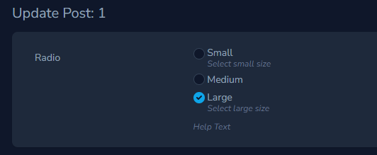

# Laravel Nova Radio Buttons Field

A Radio Buttons field for [Laravel Nova](https://nova.laravel.com/).




## Install

```
composer require norman-huth/nova-radio-field
```

## Usage

```php
use NormanHuth\NovaRadioField\Radio;

//..
Radio::make(__('Radio'), 'select')
    ->options([
        'S' => __('Small'),
        'M' => __('Medium'),
        'L' => __('Large'),
    ])
```

## Advanced Usage

### Field Help Text

> If you would like to place "help" text beneath a field, you may invoke the `help` method when defining your field:

```php
Radio::make(__('Radio'), 'select')
    ->options([/*...*/])
    ->help(__('Help Text'))
```

### Help Text For Radio Label

If you would like to place "help" text beneath a radio label, you may invoke the `radioHelpTexts` method when defining your field:

```php
Radio::make(__('Radio'), 'select')
    ->options([/*...*/])
    ->radioHelpTexts([
        'S' => __('Select small size'),
        'L' => __('Select large size'),
    ])
```

### Inline Radio Boxes

If you would like to place the radios inline instead in columns use the `inline` method:

```php
Radio::make(__('Radio'), 'select')
    ->options([/*...*/])
    ->inline()
```

### Controlling Gap

if you would like change the gap between radio buttons use the `gap` method:

**Default**: 1 (0.25rem)

| Method       | Gap      |
|--------------|----------|
| `->gap(0.5)` | 0.125rem |
| `->gap(1.5)` | 0.375rem |
| `->gap(2)`   | 0.5rem   |
| `->gap(2.5)` | 0.625rem |
| `->gap(3)`   | 0.75rem  |
| `->gap(3.5)` | 0.875rem |
| `->gap(4)`   | 1rem     |
| `->gap(5)`   | 1.25rem  |
| `->gap(6)`   | 1.5rem   |
| `->gap(8)`   | 2rem     |

```php
Radio::make(__('Radio'), 'select')
    ->options([/*...*/])
    ->gap(3)
```

#### Display Keys On Index & Detail Page

If you would like to display the values instead the label, you may invoke the `displayUsingValues` method when defining the field :wink: :

```php
Radio::make(__('Radio'), 'select')
    ->options([/*...*/])
    ->displayUsingValues()
```
